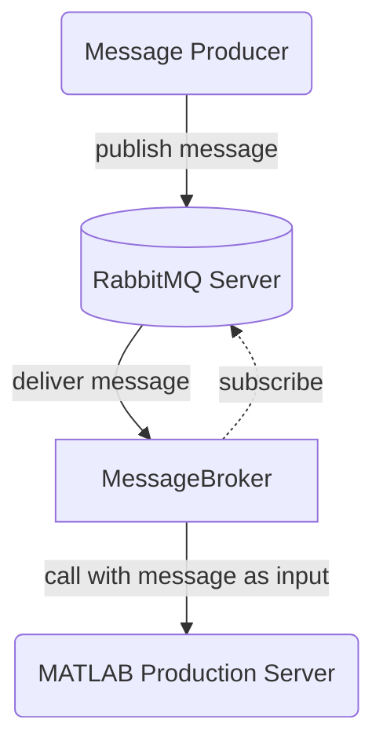
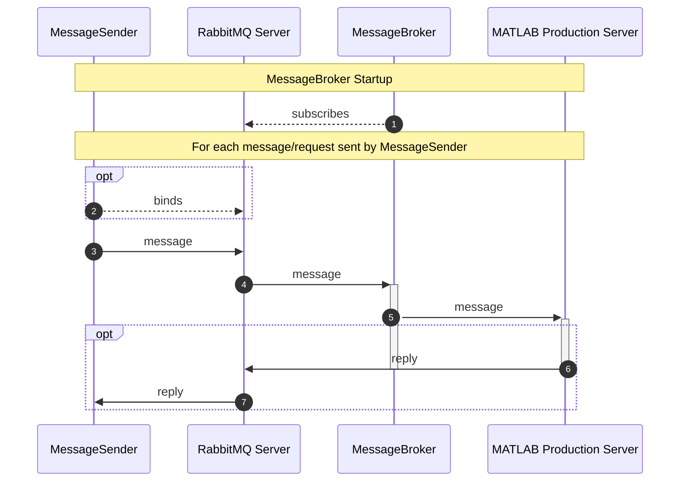

# RabbitMQ `MessageBroker` for MATLAB Production Server

## Architecture
`MessageBroker`, is essentially a RabbitMQ (AMQP) Consumer which can receive
messages from a RabbitMQ Server which it then passes along as input to a
function deployed ot MATLAB Production Server. The MATLAB function is assumed to
have exactly one input which is the message as character array.



As RabbitMQ supports various protocols (AMQP as native protocol but also MQTT
and STOMP as plugins), the Message Producer can be any client supporting any of
those protocols.

## Message Datatype
RabbitMQ messages _in general_ are simply raw bytes, this package implicitly
assumes however that all messages are UTF-8 encoded strings. Consider encoding
your messages in JSON format if "more complex" data structures need to be
represented in the messages. On the MATLAB end the `jsondecode` function can be
used to parse the JSON string into a MATLAB structure.

## Dataflow
A full workflow with this package could look like the following:



1. Upon startup `MessageBroker` connects to the configured RabbitMQ Server and
   subscribes to the specified `queue` on the specified `exchange` with
   specified `routingkey`.

2. If a MessageSender expects a reply of the function deployed to MATLAB
   Production Server through RabbitMQ, it first subscribes to the RabbitMQ
   server as well, if using the same `queue` on the same `exchange` make sure to
   use a different `routingkey` (to avoid infinite loops where the response
   would trigger another MATLAB Production Server call).

3. The MessageSender (this can literally be the `MessageSender` example client
   included in this package or any other RabbitMQ Client) sends a message with a
   `routingkey` to a `queue` on the RabbitMQ Server.

4. If the `queue` and `routingkey` match the ones `MessageBroker` has subscribed
   to, the RabbitMQ Server delivers to message to `MessageBroker`.

5. `MessageBroker` uses MATLAB Production Server Java client to call the
   specified `function` in the specified `archive` with the message as input.
   MATLAB Production Server will then process this request. If the package is
   used to simply trigger a function call without outputs the flow ends here.

6. If the MATLAB code needs to return an output to the client, the MATLAB code
   can use `rabbitmq.Producer` to send a message with the `routingkey` the
   client is bound to, to the RabbitMQ Server.

    > Note: this bypasses `MessageBroker`. `MessageBroker` does not do anything
    > with the "MATLAB style output" of the function deployed to MATLAB
    > Production Server. The MATLAB code deployed to MATLAB Production Server
    > has to explicitly use `rabbitmq.Producer` in the MATLAB code if a reply is
    > to be send over RabbitMQ.

7. If the `routingkey`, `queue` and `exchange` match the one the client has
   subscribed to, the RabbitMQ server will deliver the reply to the client.

## Installation
### Building the Java package
Refer to the [Getting Started Section in
README.md](../README.md#build-rabbitmq-matlab-java-client-package) for
instructions on building the required JAR-file.

### Further configuration and testing the setup

1.	Before continuing it is good to verify that the RabbitMQ Server is up and
running correctly and can be accessed, for example by accessing the Web Admin
console which typically runs on port 15672, so for a local server check
http://localhost:15672/.

    > Please see the [RabbitMQ Authentication, Authorization, Access Control 
    > documentation](https://www.rabbitmq.com/access-control.html) on how to 
    > configure credentials for remote access, TLS support, authentication, etc.

2.  For an initial test, MATLAB Compiler SDK's MATLAB Production Server testing
    interface can be used rather than an actual MATLAB Production Server
    instance running compiled CTF archives:

    1. In MATLAB start the `Production Server Compiler` App. 
    2. Enter `demo` as archive name.
    3. Add `Software/MATLAB/examples/MPSreceive.m` as exported function.
    4. Click `Test Client`.
    5. Click `Start` to start the test server.

3.	Open `Software/Java/RabbitMQClient/src/main/resources/mps.yaml` and update
the options to match your configuration.

    ```yaml
    # MATLAB Production Server connection properties
    mps:
      protocol: http            # Protocol used by the MPS Instance
      host: localhost           # Hostname or IP of the MPS Instance
      port: 9910                # Port the MPS Instance runs on
      archive: demo             # Name of the CTF containing the function which
                                # is to be called on MPS when a message received
      function: MPSreceive      # Function inside the archive which is to be called
      timeoutms: 120000         # Timeout on the request to MATLAB Production Server
                                # MessageBroker will log an error if the request
                                # to MATLAB Production Server did not complete within
                                # this time

    # Messaging connection and routing properties
    messageQueue:
      queueName: RabbitMQ       # Name of the Queue on RabbitMQ Server
      host: localhost           # Hostname or IP of the RabbitMQ Server
      port: 5672                # Port the RabbitMQ Server runs on
      virtualhost: /            # RabbitMQ Virtual Host
      credentials: 
        username: guest         # RabbitMQ username
        password: guest         # RabbitMQ password
      exchange: amq.topic       # Exchange to work with on RabbitMQ
      routingkey: test-topic    # Routing key to subscribe to
    ```

    If indeed working with the MATLAB Compiler SDK MATLAB Production Server testing
    interface on your local machine configured as described in step 4, the `MATLAB 
    Production Server connection properties` settings should be correct already. 

4.	To verify it is possible to successfully send a message to the RabbitMQ
Server using this configuration, the `MessageSender` application can be used. It
can be started using `MessageSenderStartup.bat` on Windows or using mvn on any
system:

    ```
    mvn exec:java -Dexec.mainClass=com.mathworks.messaging.MessageSender -Dexec.args="src/main/resources/mps.yaml"
    ```

    In the client enter a message and routingkey, then in the RabbitMQ Admin Web Console
    verify that indeed a message was received on the configured `queue`. (Ctrl+C can be
    used to stop the application).

5.	To complete the workflow, start `MessageBroker` by running
`MessageBrokerStartup.bat` on Windows or alternatively run it using mvn:

    ```
    mvn exec:java -Dexec.mainClass=com.mathworks.messaging.MessageBroker -Dexec.args="src/main/resources/mps.yaml"
    ```

    This will receive messages from the message queue and then forward these to MATLAB
    Production Server to invoke the designated MATLAB `function`. The consumer will keep
    running, waiting for messages (Use Ctrl+C to stop the application).

6.  Now when using `MessageSender` to send a message with the correct
    `routingkey` it should be received by `MessageBroker` which should then call
    the MATLAB Production Server (test) server. If indeed working with the test
    server inside MATLAB, the message should be displayed in the MATLAB Command
    Window.

[//]: #  (Copyright 2022 The MathWorks, Inc.)